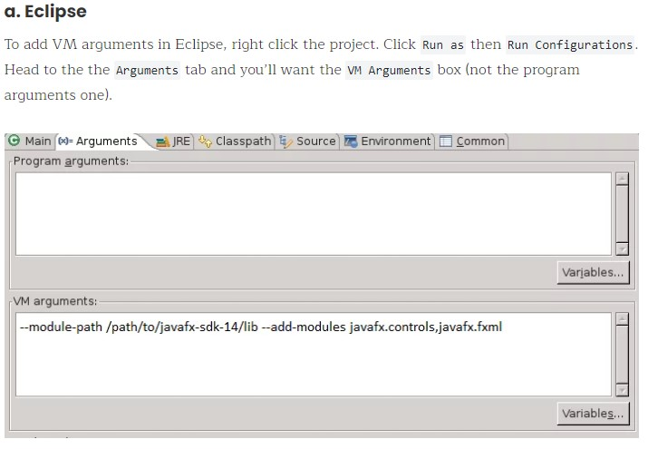

# Tugas FP PBO
Membuat game tetris.

# Tim
#### Nama Kelompok: KamiSama
#### Judul FP: Block Stack
#### Anggota Tim:
* William Handi Wijaya 05111940000087
* Stefanus Albert Kosim 05111940000096

# Kontrol (Java Swing)
Atas = putar balok.
Bawah = percepat laju turun balok.  
Kiri = geser ke kiri.  
Kanan = geser ke kanan.

# Kontrol (Java Swing)
Huruf "P" = pause.
Kiri = geser ke kiri.  
Kanan = geser ke kanan.
Atas = putar ke kiri.
Huruf "Z = putar ke kanan.
Spasi = hard drop.
Bawah = soft drop.

# Cara Import
1. Download library [javaFX](https://gluonhq.com/products/javafx/).
2. Buat Java Project baru.
3. Buat package `com.application` di dalam project yang sudah dibuat.
4. Import source code ke package `com.application`.
5. Tambahkan javaFX library di build path project.  
	* Link panduan: <https://www.javatpoint.com/javafx-with-eclipse>
6. Tambahkan VM argument di 'Run Configurations'
	* Syntax: `--module-path "/path/to/javafx-sdk/lib"  --add-modules=javafx.controls,javafx.fxml`
	* 